<h1>DimSum — GridWise Energy Optimizer</h1>

**Team PTSD · BUP CSE Fest 2026 · Online Preliminary**

An HTTP service that reads plain-English campus operator notes, turns them into machine-checkable
scheduling directives with a language model, proves those directives are safe with deterministic
guardrails, and then solves for the cheapest legal 24-hour energy plan with a linear program.

| | |
|---|---|
| **Live API** | <https://dimsum-y32f.onrender.com> |
| **Health** | <https://dimsum-y32f.onrender.com/health> |
| **Operator console** | <https://dimsum-y32f.onrender.com/> |
| **Docker image** | `pratikdev21/gridwise-energy-optimizer:latest` |
| **Model** | `gemini-3.1-flash-lite` (Google, via the Vercel AI SDK) |
| **Solver** | HiGHS 1.15.3 (WebAssembly build) |
| **Runtime** | Bun 1.3.12 |

---

## Contents

- [See it work](#see-it-work)
- [The problem in one minute](#the-problem-in-one-minute)
- [Architecture](#architecture)
- [Project structure](#project-structure)
- [How the LLM is used](#how-the-llm-is-used)
- [The guardrail layer](#the-guardrail-layer)
- [The optimizer](#the-optimizer)
- [The final validator](#the-final-validator)
- [API reference](#api-reference)
- [A complete worked example](#a-complete-worked-example)
- [Run it locally](#run-it-locally)
- [Environment variables](#environment-variables)
- [Docker](#docker)
- [Testing and verification](#testing-and-verification)
- [The operator console](#the-operator-console)
- [Design decisions](#design-decisions)
- [Known limitations](#known-limitations)
- [Dependencies and credits](#dependencies-and-credits)
- [Security and secret handling](#security-and-secret-handling)

---

## See it work

Three operator notes go in. Two become hard constraints, one is recognised as a distractor and
ignored. The six pipeline stages light up in order as a **real** request moves through them —
nothing in this recording is simulated or replayed from a fixture.

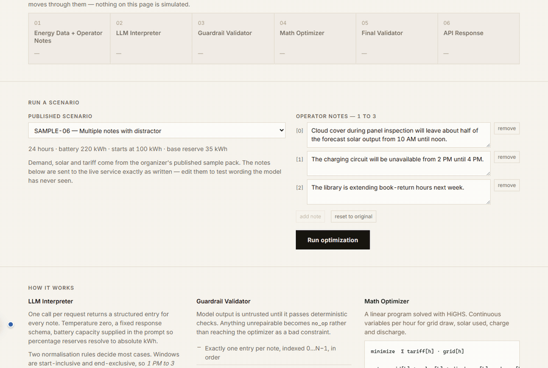

---

## The problem in one minute

A campus buys electricity from the grid, generates some of its own from rooftop solar, and can
shift energy through a battery. Demand, solar output and the grid tariff all change hour by hour.
Buying when the tariff is low and spending that energy when the tariff is high is the whole game.

The twist: operators write **notes in plain English** that change the rules for the day.

> "Solar output will drop to about 20% from 1 PM to 3 PM."
> "Do not charge the battery between 2 PM and 4 PM."
> "The cafeteria menu changes tomorrow."

The first two change the maths. The third is noise and must be ignored. The service has to tell
them apart, convert the real ones into exact numeric constraints, and produce a schedule that
obeys every one of them — while still being the cheapest such schedule.

**The core idea is that human notes are never trusted as maths.** They are converted to a fixed
structured format, checked by deterministic guardrails, and only then allowed anywhere near the
optimizer.

---

## Architecture

```mermaid
flowchart TD

subgraph group_api["API Runtime"]
  node_api_service["Optimization API<br/>[index.ts]"]
  node_request_schemas["Request Schemas<br/>[schemas.ts]"]
  node_response_builder["Response Builder<br/>[index.ts]"]
end

subgraph group_safety["Interpretation Safety"]
  node_llm_interpreter["LLM Interpreter<br/>[interpreter.ts]"]
  node_guardrail_validator["Guardrail Validator<br/>[guardrails.ts]"]
end

subgraph group_planning["Planning Validation"]
  node_math_optimizer["Math Optimizer<br/>[optimizer.ts]"]
  node_final_validator["Final Validator<br/>[validator.ts]"]
  node_baseline_planner["Baseline Planner<br/>[index.ts]"]
end

subgraph group_console["Operator Console"]
  node_web_console["Web Console<br/>[app.js]"]
  node_browser_replay["Browser Replay<br/>[validate.js]"]
  node_result_charts["Result Charts<br/>[charts.js]"]
end

node_operator(("Operator"))
node_energy_inputs["Energy Inputs"]
node_gemini["Gemini Model"]
node_highs_solver["HiGHS Solver"]

node_operator -->|"uses"| node_web_console
node_energy_inputs -->|"submits data"| node_api_service
node_web_console -->|"calls API"| node_api_service
node_api_service -->|"validates request"| node_request_schemas
node_api_service -->|"interprets notes"| node_llm_interpreter
node_llm_interpreter -.->|"queries model"| node_gemini
node_api_service -->|"sanitizes directives"| node_guardrail_validator
node_api_service -->|"solves schedule"| node_math_optimizer
node_math_optimizer -->|"solves LP"| node_highs_solver
node_api_service -->|"replays checks"| node_final_validator
node_api_service -.->|"falls back"| node_baseline_planner
node_api_service -->|"assembles result"| node_response_builder
node_response_builder -->|"returns plan"| node_web_console
node_web_console -->|"rechecks plan"| node_browser_replay
node_web_console -->|"renders charts"| node_result_charts

click node_api_service "https://github.com/samisdone/dimsum-bup-cse-fest-preli-team-ptsd/blob/main/src/index.ts"
click node_request_schemas "https://github.com/samisdone/dimsum-bup-cse-fest-preli-team-ptsd/blob/main/src/schemas.ts"
click node_response_builder "https://github.com/samisdone/dimsum-bup-cse-fest-preli-team-ptsd/blob/main/src/index.ts"
click node_llm_interpreter "https://github.com/samisdone/dimsum-bup-cse-fest-preli-team-ptsd/blob/main/src/interpreter/interpreter.ts"
click node_guardrail_validator "https://github.com/samisdone/dimsum-bup-cse-fest-preli-team-ptsd/blob/main/src/interpreter/guardrails.ts"
click node_math_optimizer "https://github.com/samisdone/dimsum-bup-cse-fest-preli-team-ptsd/blob/main/src/optimizer/optimizer.ts"
click node_final_validator "https://github.com/samisdone/dimsum-bup-cse-fest-preli-team-ptsd/blob/main/src/validator/validator.ts"
click node_baseline_planner "https://github.com/samisdone/dimsum-bup-cse-fest-preli-team-ptsd/blob/main/src/index.ts"
click node_web_console "https://github.com/samisdone/dimsum-bup-cse-fest-preli-team-ptsd/blob/main/web/app.js"
click node_browser_replay "https://github.com/samisdone/dimsum-bup-cse-fest-preli-team-ptsd/blob/main/web/validate.js"
click node_result_charts "https://github.com/samisdone/dimsum-bup-cse-fest-preli-team-ptsd/blob/main/web/charts.js"

classDef toneNeutral fill:#f8fafc,stroke:#334155,stroke-width:1.5px,color:#0f172a
classDef toneBlue fill:#dbeafe,stroke:#2563eb,stroke-width:1.5px,color:#172554
classDef toneAmber fill:#fef3c7,stroke:#d97706,stroke-width:1.5px,color:#78350f
classDef toneMint fill:#dcfce7,stroke:#16a34a,stroke-width:1.5px,color:#14532d
classDef toneRose fill:#ffe4e6,stroke:#e11d48,stroke-width:1.5px,color:#881337
classDef toneIndigo fill:#e0e7ff,stroke:#4f46e5,stroke-width:1.5px,color:#312e81
classDef toneTeal fill:#ccfbf1,stroke:#0f766e,stroke-width:1.5px,color:#134e4a
class node_api_service,node_request_schemas,node_response_builder toneBlue
class node_llm_interpreter,node_guardrail_validator toneAmber
class node_math_optimizer,node_final_validator,node_baseline_planner toneMint
class node_web_console,node_browser_replay,node_result_charts toneRose
class node_operator,node_energy_inputs,node_gemini,node_highs_solver toneIndigo
```

<details>
<summary>Static render of the same diagram</summary>

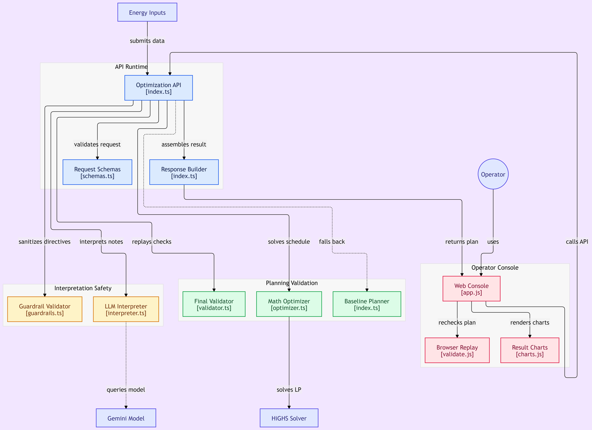

</details>

### The six stages

The pipeline is named exactly as the Problem Statement names it, and the console labels each stage
with the same words so a reviewer can watch a request move through them.

| # | Stage | Where | What it does |
|---|---|---|---|
| 01 | Energy Data + Operator Notes | [`schemas.ts`](src/schemas.ts) | Zod validates shape before anything else runs. A bad body is a `400`, not an exception. |
| 02 | LLM Interpreter | [`interpreter.ts`](src/interpreter/interpreter.ts) | One model call per request returns a structured entry per note. Output is treated as untrusted. |
| 03 | Guardrail Validator | [`guardrails.ts`](src/interpreter/guardrails.ts) | Deterministic repair and rejection. Guarantees exactly one valid directive per note. |
| 04 | Math Optimizer | [`optimizer.ts`](src/optimizer/optimizer.ts) | Builds an LP from the validated directives and solves it with HiGHS. |
| 05 | Final Validator | [`validator.ts`](src/validator/validator.ts) | Replays the judge's own checks against the finished plan. |
| 06 | API Response | [`index.ts`](src/index.ts) | Totals recomputed from the returned plan, never carried forward from the solver. |

Every arrow is one-way, and each stage distrusts the one before it. That is the whole design.

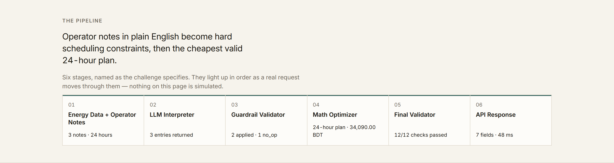

---

## Project structure

```
.
├── src/
│   ├── index.ts                   # HTTP service: routing, request validation, stage
│   │                              #   orchestration, response assembly, baseline fallback
│   ├── schemas.ts                 # Zod schemas for the request and response contracts
│   ├── types.ts                   # Shared types, frozen early so the stages could be
│   │                              #   built in parallel without stepping on each other
│   ├── interpreter/
│   │   ├── interpreter.ts         # Stage 02. The model call, the retry ladder, and the
│   │   │                          #   deterministic fallback extractor
│   │   └── guardrails.ts          # Stage 03. guard(): untrusted model output in,
│   │                              #   exactly one valid Directive per note out
│   ├── optimizer/
│   │   ├── optimizer.ts           # Stage 04. LP construction, HiGHS solve, plan assembly,
│   │   │                          #   rounding repair, relaxation ladder
│   │   └── optimizer.test.ts      # 33 tests
│   └── validator/
│       └── validator.ts           # Stage 05. replay() and checkTotals(), written from the
│                                  #   Problem Statement rather than from optimizer.ts
│
├── web/                           # The DimSum operator console, served by the API itself
│   ├── index.html                 #   from /, with the judged endpoints untouched
│   ├── app.js                     # Live calls, pipeline state, result rendering
│   ├── charts.js                  # Hand-rolled SVG charts — no chart library
│   ├── validate.js                # A second, independent replay of the judge's checks,
│   │                              #   run in the browser against whatever the API returned
│   ├── styles.css
│   └── samples.json               # INPUTS of the 10 published scenarios + reference costs
│
├── data/
│   └── BUP_CSE_FEST_2026_Preli_Public_Sample_Cases.json   # organizer sample pack
│
├── docs/
│   ├── assets/                    # README images
│   ├── ACTION_PLAN.md             # how the work was split across the team
│   └── BUP_CSE_FEST_2026_*.md     # problem statement and rubric, for reference
│
├── run-public.ts                  # Public-pack harness. HTTP mode or in-process mode
├── verify.ts                      # Offline guardrail + extractor checks, no network
├── eval-notes.ts                  # Interpretation accuracy against the live model
├── fault-inject.ts                # Malformed input, stability, secret-leak probes
├── check-key.ts                   # Credential probe
├── validator.test.ts              # 20 tests for the final validator
│
├── Dockerfile                     # Bun slim image, non-root, binds 0.0.0.0, no secrets
└── .github/workflows/
    └── docker-publish.yml         # Test, then build and publish to Docker Hub
```

**Why the stages sit in their own folders.** Each one is owned end-to-end and has a single
entry point. `validator.ts` in particular was written against the Problem Statement text without
reading `optimizer.ts`, so that the final replay is a genuine independent check rather than a
mirror of the code that produced the plan. When the two disagree, that disagreement is real
information.

---

## How the LLM is used

> **The language model is the primary interpretation path, and it is what produces the structured
> directives the optimizer consumes.** It is not used for `plan_summary`, cosmetic text, or
> documentation.

One `generateObject` call per request, at `temperature: 0`, against a fixed response schema. The
model receives the operator notes, the battery capacity and the base reserve — the last two so a
note like *"keep it at 40% of capacity"* can be resolved to absolute kWh by the model rather than
guessed downstream.

The response schema is deliberately **flat**:

```ts
{ note_index, directive_type, hours?, factor?, minimum_energy_kwh?, max_grid_kwh?, explanation }
```

Two consequences, both intentional:

1. **The model cannot emit a malformed `structured_adjustment`,** because it never emits one.
   `guardrails.ts` assembles the nested object from these flat fields.
2. **There is no `applies` field.** It is derived (`directive_type !== "no_op"`), so the model
   cannot contradict itself by marking a real directive as not applying.

The system prompt pins down the two normalisation rules that decide most cases — windows are
start-inclusive and end-exclusive (`1 PM to 3 PM` → `[13, 14]`), and `factor` is the fraction that
*remains* (an 80% reduction is `0.2`, not `0.8`) — and gives worked examples of each.

### When the model is unavailable

A hosted model can time out, rate-limit, or go down mid-evaluation. The ladder is:

```
model call (8s)  →  one retry (4s)  →  deterministic extractor
```

A `429` skips the retry, because the free-tier quota needs roughly 50 seconds to clear and a
second immediate attempt only burns latency budget.

The last rung is a regex-based extractor in [`interpreter.ts`](src/interpreter/interpreter.ts).
**It is not the interpreter** — the model runs first on every single request, and the extractor
only sees a note once the model path has genuinely failed. It exists because a provider outage
should degrade to a correct-but-unpolished reading rather than silently dropping every directive.
Its output goes through the same guardrails as the model's, with no special treatment.

Successful model responses are cached in-process, keyed on the notes *and* the battery fields that
reach the prompt. Fallback results are never cached, so one transient outage cannot poison a
paraphrase for the rest of the evaluation window.

---

## The guardrail layer

`guard()` takes whatever the model produced and returns **exactly one valid directive per note, in
`note_index` order** — always, including when the model returns nothing usable at all.

| Guardrail | Behaviour |
|---|---|
| Allowed types | Anything outside the six supported types collapses to `no_op`. Never invented. |
| Note mapping | An index that does not identify a real note is discarded. Every note gets an entry. |
| Duplicate indices | Two claims on the same note with the same real type are **merged**: hours unioned, numeric bound tightened. Conflicting types keep the first valid mapping. |
| Hours | Coerced to unique integers 0–23, ascending. A directive with no usable hour becomes `no_op`. |
| Solar factor | Must be finite and within `[0, 1]`, or the entry becomes `no_op`. |
| Battery reserve | Must be finite and non-negative. A reserve above capacity is clamped to capacity rather than discarded — "keep it full" is still meaningful. |
| Grid cap | Must be finite and non-negative. A cap of exactly `0` is legitimate and is honoured. |
| `applies` semantics | Derived, never taken from the model. `no_op` ⇒ `applies: false` and `structured_adjustment: null`. Everything else ⇒ `applies: true`. |
| Failure mode | Never throws. Anything unrepairable becomes `no_op` rather than reaching the optimizer as a bad constraint. |

The merge rule matters more than it looks. It uses the *most restrictive* reading — minimum factor,
maximum reserve, minimum grid cap — and the optimizer applies overlapping directives the same way,
so the two can never disagree about what a constraint was.

---

## The optimizer

A linear program, solved with HiGHS. Four continuous variables per hour: grid draw `g`, solar used
`s`, charge `c`, discharge `d`, plus the battery state `E`.

```
minimise    Σ  tariff[h] · g[h]

subject to  g[h] + s[h] + d[h] − c[h] = demand[h]           energy balance, every hour
            E[0] − c[0] + d[0]        = initial_energy
            E[h] − E[h−1] − c[h] + d[h] = 0                 h ≥ 1

bounds      0 ≤ s[h] ≤ effective_solar[h]                   curtailment allowed
            0 ≤ c[h] ≤ max_charge        (0 in a no-charge window)
            0 ≤ d[h] ≤ max_discharge     (0 in a no-discharge window)
            0 ≤ g[h] ≤ grid_cap[h]
            reserve[h] ≤ E[h] ≤ capacity
            E[23] = initial_energy                          end-of-day neutrality
```

Directives enter as coefficients, exactly as the Problem Statement specifies: `solar_reduction`
scales `effective_solar`, `minimum_battery_reserve` raises the lower bound on `E`, the window
directives zero a variable's upper bound, and `max_grid_window` caps `g`.

Three things that look like details but decide whether a plan is valid:

- **Simultaneous charge and discharge are netted.** An LP will happily return both in the same
  hour; the response schema allows exactly one action, so the flows are netted before reporting.
- **Grid is derived from the balance equation, not rounded independently.** Rounding four values
  separately breaks the balance by rounding dust; deriving `g` last means the equation holds to
  float precision.
- **End-of-day neutrality is repaired exactly.** After rounding, any residual is pushed onto hours
  that can absorb it without breaking a rate limit or a closed window, so `E[23]` equals
  `initial_energy` exactly rather than within tolerance.

If the LP is infeasible — which, for a valid scoring scenario, means a note was misread upstream
rather than that the day is impossible — a relaxation ladder drops the softest directive family
first and re-solves: grid caps, then raised reserves, then the windows. The audit always runs
against the **full** directive set, so a relaxed solve that happens to satisfy everything is still
returned as fully valid. The last resort is a baseline plan with the battery idle all day.

---

## The final validator

`replay()` re-runs the judge's checks on the finished plan and returns a list of violations; empty
means valid. It checks all twelve of these:

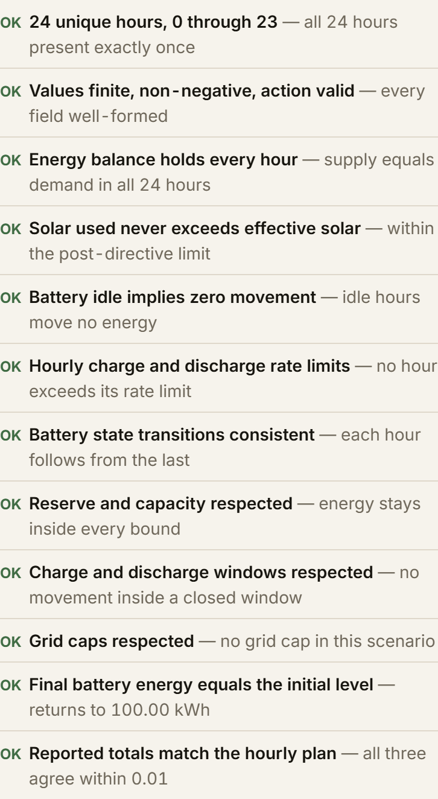

If it finds any violation, [`index.ts`](src/index.ts) throws the plan away and returns the baseline
instead — a worse plan, but a *valid* one, and `plan_summary` says so plainly.

The same checks are implemented a third time in [`web/validate.js`](web/validate.js) and run in the
browser against whatever the deployed API returned, so the console can prove a plan independently
of the service that produced it.

---

## API reference

Two endpoints are judged. Both accept and return JSON, with no authentication, no redirect and no
HTML error pages.

### `GET /health`

```bash
curl -s https://dimsum-y32f.onrender.com/health
```

```json
{ "status": "ok" }
```

Never calls the model — it has to answer even when the provider is down.

### `POST /optimize-energy`

Accepts one scenario object and returns the interpretation plus the 24-hour plan.

| Code | Meaning |
|---|---|
| `200` | Successful optimization. |
| `400` | Malformed JSON, or a body that fails schema validation. |
| `500` | Controlled internal error. No stack traces, no secrets. |

**Response fields**

| Field | Type | Notes |
|---|---|---|
| `scenario_id` | string | Echoed from the request. |
| `directive_interpretation` | array | One entry per note, in `note_index` order. |
| `hourly_plan` | array[24] | `hour`, `grid_kwh`, `solar_used_kwh`, `battery_action`, `battery_kwh`, `battery_energy_after_kwh`. |
| `total_grid_kwh` | number | Recomputed from `hourly_plan`. |
| `total_cost_bdt` | number | Recomputed from `hourly_plan`. |
| `peak_grid_kwh` | number | Recomputed from `hourly_plan`. |
| `plan_summary` | string | Human-readable description of the strategy actually used. |

### Other routes

`GET /` serves the operator console and `GET /api-info` returns a service description. Neither sits
in front of the judged endpoints — the console is a *client* of the same public API, and nothing
about `/health` or `/optimize-energy` depends on it.

---

## A complete worked example

This is the canonical example from the Problem Statement, run against the live service. Copy and
paste it as-is.

```bash
curl -s -X POST https://dimsum-y32f.onrender.com/optimize-energy \
  -H 'content-type: application/json' \
  -d '{
  "scenario_id": "GRID-101",
  "operator_notes": [
    "Solar output will drop to about 20% from 1 PM to 3 PM.",
    "Do not charge the battery between 2 PM and 4 PM.",
    "The cafeteria menu changes tomorrow."
  ],
  "battery": {
    "capacity_kwh": 500, "initial_energy_kwh": 200, "minimum_energy_kwh": 50,
    "max_charge_kwh_per_hour": 100, "max_discharge_kwh_per_hour": 100
  },
  "hours": [
    {"hour":0,"demand_kwh":120,"solar_kwh":0,"tariff_bdt_per_kwh":6},
    {"hour":1,"demand_kwh":110,"solar_kwh":0,"tariff_bdt_per_kwh":6},
    {"hour":2,"demand_kwh":105,"solar_kwh":0,"tariff_bdt_per_kwh":6},
    {"hour":3,"demand_kwh":100,"solar_kwh":0,"tariff_bdt_per_kwh":6},
    {"hour":4,"demand_kwh":105,"solar_kwh":0,"tariff_bdt_per_kwh":6},
    {"hour":5,"demand_kwh":115,"solar_kwh":0,"tariff_bdt_per_kwh":7},
    {"hour":6,"demand_kwh":140,"solar_kwh":10,"tariff_bdt_per_kwh":8},
    {"hour":7,"demand_kwh":165,"solar_kwh":45,"tariff_bdt_per_kwh":9},
    {"hour":8,"demand_kwh":185,"solar_kwh":95,"tariff_bdt_per_kwh":9},
    {"hour":9,"demand_kwh":195,"solar_kwh":140,"tariff_bdt_per_kwh":9},
    {"hour":10,"demand_kwh":200,"solar_kwh":175,"tariff_bdt_per_kwh":9},
    {"hour":11,"demand_kwh":205,"solar_kwh":195,"tariff_bdt_per_kwh":9},
    {"hour":12,"demand_kwh":205,"solar_kwh":200,"tariff_bdt_per_kwh":9},
    {"hour":13,"demand_kwh":200,"solar_kwh":185,"tariff_bdt_per_kwh":9},
    {"hour":14,"demand_kwh":190,"solar_kwh":150,"tariff_bdt_per_kwh":9},
    {"hour":15,"demand_kwh":185,"solar_kwh":105,"tariff_bdt_per_kwh":9},
    {"hour":16,"demand_kwh":195,"solar_kwh":55,"tariff_bdt_per_kwh":10},
    {"hour":17,"demand_kwh":215,"solar_kwh":15,"tariff_bdt_per_kwh":12},
    {"hour":18,"demand_kwh":235,"solar_kwh":0,"tariff_bdt_per_kwh":14},
    {"hour":19,"demand_kwh":240,"solar_kwh":0,"tariff_bdt_per_kwh":14},
    {"hour":20,"demand_kwh":220,"solar_kwh":0,"tariff_bdt_per_kwh":12},
    {"hour":21,"demand_kwh":185,"solar_kwh":0,"tariff_bdt_per_kwh":9},
    {"hour":22,"demand_kwh":155,"solar_kwh":0,"tariff_bdt_per_kwh":7},
    {"hour":23,"demand_kwh":130,"solar_kwh":0,"tariff_bdt_per_kwh":6}
  ]
}'
```

**The interpretation that comes back:**

```json
[
  {
    "note_index": 0,
    "applies": true,
    "directive_type": "solar_reduction",
    "structured_adjustment": { "hours": [13, 14], "factor": 0.2 },
    "explanation": "Solar output is reduced to 20% of forecast between 1 PM and 3 PM."
  },
  {
    "note_index": 1,
    "applies": true,
    "directive_type": "no_charge_window",
    "structured_adjustment": { "hours": [14, 15] },
    "explanation": "Battery charging is prohibited between 2 PM and 4 PM."
  },
  {
    "note_index": 2,
    "applies": false,
    "directive_type": "no_op",
    "structured_adjustment": null,
    "explanation": "Cafeteria menu changes do not impact energy scheduling."
  }
]
```

**And the part of the plan that proves the directives were actually applied:**

```json
[
  { "hour": 12, "grid_kwh": 105, "solar_used_kwh": 200, "battery_action": "charge",  "battery_kwh": 100, "battery_energy_after_kwh": 430 },
  { "hour": 13, "grid_kwh": 233, "solar_used_kwh": 37,  "battery_action": "charge",  "battery_kwh": 70,  "battery_energy_after_kwh": 500 },
  { "hour": 14, "grid_kwh": 160, "solar_used_kwh": 30,  "battery_action": "idle",    "battery_kwh": 0,   "battery_energy_after_kwh": 500 },
  { "hour": 15, "grid_kwh": 80,  "solar_used_kwh": 105, "battery_action": "idle",    "battery_kwh": 0,   "battery_energy_after_kwh": 500 }
]
```

Read the two constrained hours closely:

- **Hour 13** has 185 kWh of base solar, but only **37 kWh** is used — exactly `185 × 0.2`. The
  `solar_reduction` directive reached the maths, not just the JSON.
- **Hours 14 and 15** are `idle`. The optimizer would dearly like to charge at hour 15, where solar
  is plentiful and the tariff is about to double, but the `no_charge_window` forbids it. It charges
  hard at hours 12 and 13 instead, filling the battery to capacity *before* the window closes, then
  rides the 14 BDT evening peak on stored energy.

That second behaviour is the whole point of the challenge: a correct interpretation is worth
nothing unless the schedule bends around it.

---

## Run it locally

From a clean clone, with no prior setup. The only prerequisite is [Bun](https://bun.sh) 1.3+.

```bash
# 1. clone
git clone https://github.com/SamisDone/DimSum-BUP-CSE-Fest-Preli-Team-PTSD.git
cd DimSum-BUP-CSE-Fest-Preli-Team-PTSD

# 2. install
bun install

# 3. configure — copy the template and add your own key
cp .env.example .env
#    then edit .env and set GEMINI_API_KEY=<your key>
#    Get one free at https://aistudio.google.com/apikey

# 4. start
bun run start
# → GridWise service listening on http://0.0.0.0:3000
```

> `0.0.0.0` is a bind address, not a URL. Open **`http://localhost:3000`** in a browser.

**Confirm it works**, from a second terminal:

```bash
curl -s http://localhost:3000/health
# {"status":"ok"}

bun run public
# PASS  SAMPLE-01 ... PASS SAMPLE-10
# interpretation 10/10
# validity 10/10
# cost 10/10
```

`bun run public` sends all ten published scenarios to `http://localhost:3000` over HTTP, compares
the returned directives against the organizer's expected interpretation, independently replays each
returned plan, and compares the recalculated cost against the published reference. Point it
anywhere with `--url`:

```bash
bun run public -- --url https://dimsum-y32f.onrender.com
```

### Running without a key

The service starts and answers correctly with no `GEMINI_API_KEY` at all — the model path fails
immediately and the deterministic extractor takes over, which still resolves every note in the
public pack. This is a degraded mode for reviewers, not the intended path; the model is primary
whenever credentials are present.

---

## Environment variables

Names only. **No secret values appear in this repository.**

| Variable | Required | Default | Purpose |
|---|---|---|---|
| `GEMINI_API_KEY` | **yes** | — | Google AI Studio key for the interpreter. `GOOGLE_GENERATIVE_AI_API_KEY` and `GOOGLE_API_KEY` are also accepted. |
| `GEMINI_MODEL` | no | `gemini-3.1-flash-lite` | Model identifier. |
| `PORT` | no | `3000` | Listen port. |
| `HOSTNAME` | no | `0.0.0.0` | Bind address. Leave as-is in containers. |
| `LLM_TIMEOUT_MS` | no | `8000` | First model attempt. |
| `LLM_RETRY_TIMEOUT_MS` | no | `4000` | Second attempt, shorter so the tail stays bounded. |
| `LLM_RETRY_DELAY_MS` | no | `300` | Pause between attempts. |
| `EVAL_DELAY_MS` | no | `4500` | Pacing for the eval harnesses against a rate-limited free tier. |

`DOCKERHUB_USERNAME` and `DOCKERHUB_TOKEN` are **GitHub Actions secrets** used only by the publish
workflow. They are never read by the service.

---

## Docker

The image is the fallback execution path. It binds `0.0.0.0`, runs as a non-root user, contains no
baked-in credentials, and takes the key from the environment at runtime.

```bash
docker pull pratikdev21/gridwise-energy-optimizer:latest

docker run --rm -p 3000:3000 \
  -e GEMINI_API_KEY=<your-key> \
  pratikdev21/gridwise-energy-optimizer:latest
```

Then:

```bash
curl -s http://localhost:3000/health
# {"status":"ok"}
```

| | |
|---|---|
| Registry | Docker Hub — `docker.io/pratikdev21/gridwise-energy-optimizer` |
| Tags | `latest`, plus an immutable `sha-<commit>` tag for every build |
| Exposed port | `3000` (override with `-e PORT=...` and a matching `-p`) |
| Base image | `oven/bun:1-slim` |
| Size | ~81 MB |
| User | non-root (`bun`) |

For a reproducible pin, use the commit-tagged form instead of `latest`:

```bash
docker pull pratikdev21/gridwise-energy-optimizer:sha-<commit-sha>
```

Building it yourself:

```bash
docker build -t gridwise .
docker run --rm -p 3000:3000 -e GEMINI_API_KEY=<your-key> gridwise
```

---

## Testing and verification

| Command | What it covers | Network | Expected |
|---|---|---|---|
| `bun run verify` | Guardrails against malformed model output; the fallback extractor against the public pack and against unseen paraphrases | none | `22/22 · 18/18 · 24/24` |
| `bun test` | Optimizer and final validator unit tests | none | `53 pass, 0 fail` |
| `bun run public` | Full pipeline over HTTP, all 10 published scenarios | local API | `10/10` interpretation, validity, cost |
| `bun run public -- --directives-from-expected` | Optimizer alone, fed the organizer's ground-truth directives | none | `10/10`, exact reference costs |
| `bun run faults` | Malformed JSON, wrong array lengths, too many notes, 20 rapid requests, secret-leak scan | local API | all `[PASS]` |
| `bun run eval:notes` | Interpretation accuracy against the live model | model API | `10/10` cases, `18/18` notes |
| `bun run check:key` | Credential probe | model API | reports key validity |

Everything above passes on the current commit, **against the deployed service as well as locally**:

```
$ bun run public -- --url https://dimsum-y32f.onrender.com
PASS  SAMPLE-01 … PASS  SAMPLE-10
interpretation 10/10
validity 10/10
cost 10/10
latency median 3880ms / p90 12645ms
```

The optimizer reproduces the organizer's published optimal cost **exactly** on all ten scenarios,
not merely within tolerance:


---

## The operator console

Served from `/` on the same origin as the API. It is a convenience for reviewers, not a gate: the
judged endpoints have no authentication, no redirect and no dependency on it.

Pick one of the ten published scenarios, edit the operator notes to anything you like, and watch a
real request move through all six stages. Every number on the page comes from a live call — if the
service is down the page says so rather than showing stale values.

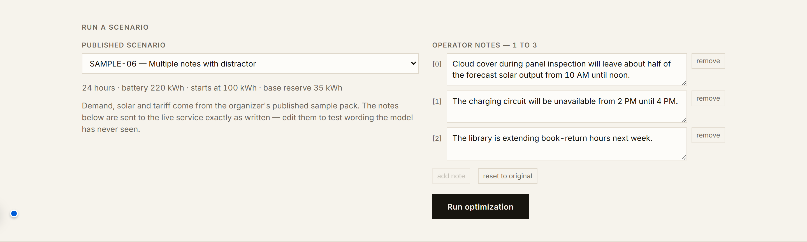

The interpretation panel shows each note beside the directive it produced and the exact
`structured_adjustment` that went to the optimizer — including the distractors it correctly refused
to act on:

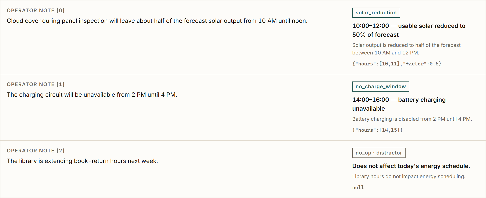

The charts shade the hours a directive touched, so the effect of a note is visible rather than
merely asserted. Grid draw is teal, solar amber, battery clay; the dashed line is demand.

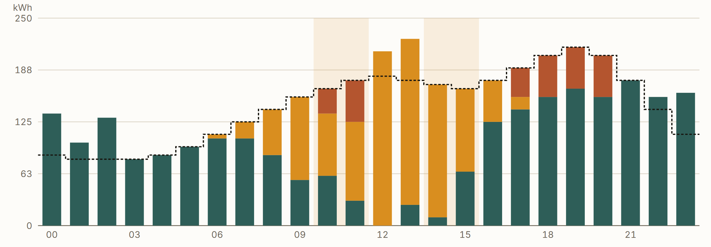

Battery state against its floor and ceiling, and grid draw against the tariff curve:

<p>
  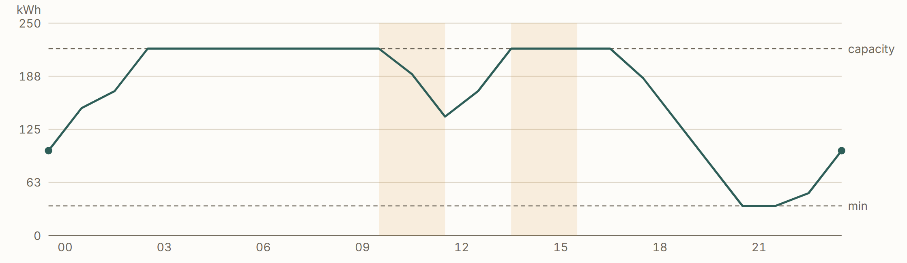
  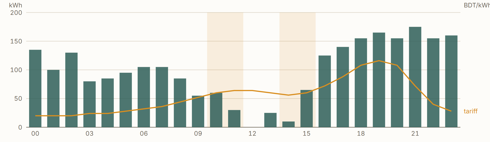
</p>

It follows the system dark mode, and respects an explicit toggle:

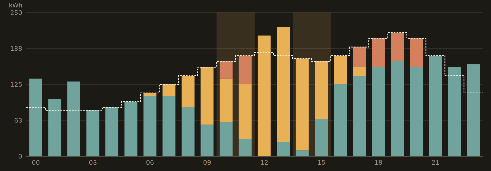

---

## Design decisions

**The model never emits nested JSON.** A flat schema plus a deterministic assembler removes an
entire class of malformed-output failures, and makes `applies` impossible to get wrong because it
is derived rather than reported.

**The final validator was written blind.** It implements the Problem Statement's checks without
reference to `optimizer.ts`. An independent check that agrees is evidence; a mirror of the same
code that agrees is nothing.

**Guardrails repair rather than reject where the intent survives.** A reserve above capacity is
clamped, duplicate note claims are merged most-restrictively, hours are deduplicated and sorted.
Where intent does *not* survive — an unsupported type, a factor outside `[0,1]`, a directive with no
parseable window — the entry becomes `no_op` instead of a guess. Guessing invents a hard constraint.

**No `thinkingConfig` on the model call.** Benchmarked over the same prompt: thinking `low`
averaged 5759 ms, budget `0` averaged 4466 ms, and omitting it entirely averaged 2324 ms with a much
tighter spread. All three were equally accurate. This is schema-constrained extraction, not
reasoning, and tail latency is scored.

**Totals are always recomputed from the returned plan.** Never carried forward from the solver's
objective value, so the three aggregates cannot drift from the hourly rows a judge recalculates.

**The console is a client, not a layer.** It was tempting to put it in front of the API. The
Participant Guide forbids a dashboard being required to reach the endpoints, so it sits beside them
and calls the same public routes anyone else would.

---

## Known limitations

- **Latency is provider-bound.** Cold-cache median is roughly 6–7 s end-to-end, with a p90 near
  12 s, and nearly all of it is the model call. Local benchmarks of three identical one-word prompts
  returned in 14293 ms / 3844 ms / 2648 ms — the variance is upstream, not in our code. The retry
  ladder is deliberately capped so the worst case (both attempts time out, extractor answers
  instantly) stays near 12.3 s, well inside the 30 s per-request ceiling.
- **The free-tier quota is 15 requests per minute.** Under sustained load some requests will hit a
  `429` and fall through to the deterministic extractor. Interpretation stays correct on everything
  we have tested, but paraphrase robustness on unusual wording is weaker on that path than on the
  model path. Enabling billing on the key removes this entirely.
- **The fallback extractor is regex-based** and will not match every conceivable phrasing. It is a
  safety net for provider outages, not a second interpreter.
- **The first request after a cold start on a free Render instance can take ~30 s** while the
  container wakes. `/health` is the cheapest way to warm it before a timed run.
- **Directives are applied most-restrictively when they overlap.** If two notes constrain the same
  hour, the tighter bound wins. This matches the guardrail merge rule but is a choice, not a
  requirement of the specification.

---

## Dependencies and credits

| Dependency | Version | Role |
|---|---|---|
| [Bun](https://bun.sh) | 1.3.12 | Runtime, HTTP server, test runner, bundler |
| [`ai`](https://www.npmjs.com/package/ai) (Vercel AI SDK) | ^7.0.106 | Structured model output via `generateObject` |
| [`@ai-sdk/google`](https://www.npmjs.com/package/@ai-sdk/google) | ^4.0.75 | Google Generative AI provider |
| [`highs`](https://www.npmjs.com/package/highs) | ^1.15.3 | WebAssembly build of the HiGHS LP solver |
| [`zod`](https://zod.dev) | ^4.6.5 | Request and response schema validation |

The charts in the console are hand-rolled SVG; there is no charting library. Everything else in
`web/` is vanilla JavaScript with no build step.

**Model provider:** Google AI Studio, `gemini-3.1-flash-lite`.
**Solver:** HiGHS, the open-source C++ optimization solver, compiled to WebAssembly.

AI coding assistants were used during development, as the rulebook permits. The architecture —
the six-stage split, the flat interpreter schema, the derived `applies` field, the independent
final validator, and the relaxation ladder — is the team's own.

---

## Security and secret handling

- **No secrets in the repository.** `.env` is gitignored and has never been committed; only
  `.env.example`, which contains variable names and no values, is tracked.
- **No secrets in the image.** The Dockerfile bakes in nothing; the key is read from the
  environment at runtime. `.dockerignore` excludes `.env` explicitly.
- **No secrets in responses or logs.** Error paths return `{"error", "message"}` with no stack
  traces. The interpreter logs only a truncated error message, never the key or the raw error
  object. `bun run faults` scans every response body for the key as a regression check.
- **Only synthetic challenge data** is used — the organizer's published sample pack.
- The repository was created after question reveal, kept private during the event, and made public
  after the submission deadline for evaluation.

---

<div align="center">

**Team PTSD** · BUP CSE Fest 2026 Online Preliminary
Built with Bun, Gemini and HiGHS

</div>
